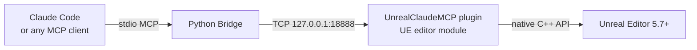
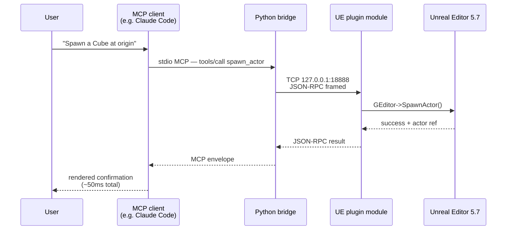

<div align="center">

# Unreal Claude MCP

**Drive Unreal Engine 5 from Claude Code over a local TCP socket.**

102 tools total. Zero pixel-clicking. ~50ms round-trip.

[](https://github.com/NAJEMWEHBE/UnrealClaudeMCP/actions/workflows/tests.yml)
[](LICENSE)
[](https://www.unrealengine.com/)
[](https://www.python.org/)
[](https://modelcontextprotocol.io/)
[](tests/)
[](docs/TOOLS.md)
[](CHANGELOG.md)
[](#contributing)


</div>

<!-- TODO: drop a 10-15s demo screencast at docs/images/demo-screencast.gif and embed it here:
     
     Frame ideas: client types a tool call → bridge round-trip animates → UE viewport reframes /
     spawns an actor / changes color. No audio needed; loop 5-10x with a clear before/after. -->

---

## Jump to

- [How it fits together](#how-it-fits-together) — architecture diagram + per-call sequence
- [Why it exists](#why-it-exists) — the UE 5.7 Python dead-ends this plugin sidesteps
- [Why MCP specifically](#why-mcp-specifically) — one protocol, every conforming client
- [Tools](#tools) — 102 tools grouped into 14 expandable categories
- [Quick start](#quick-start) — copy-paste path to a running editor with the plugin live
- [What's in the box](#whats-in-the-box) — directory tree
- [Status](#status) — release / test / build state
- [Contributing](#contributing) — house rules + how to add a tool
- [License](#license)

---

## How it fits together



<details>
<summary><b>Per-call sequence</b> — click to see exactly what fires on a single tool call</summary>



</details>

You ask Claude Code: *"Take a screenshot of my level and tell me what's there."* — Claude resolves the request to a tool call, the bridge forwards it as JSON-RPC to the running editor, the plugin captures the viewport, and Claude renders the image inline. Same flow works for spawning actors, inspecting Blueprints, mutating Widget Trees, executing arbitrary `unreal.*` Python, listing actors, focusing the viewport, loading levels, taking high-res screenshots.

The plugin binds to **`127.0.0.1` only** — your running editor is never reachable across the network.

---

## Why it exists

UE 5.7's Python reflection has known dead-ends. Most painfully: `EditorUtilityWidgetBlueprint.WidgetTree` is a `UPROPERTY()` without `EditAnywhere`, so neither `get_editor_property` nor direct attribute access can reach it. This blocks "let an LLM build me an editor utility panel" workflows entirely.

The plugin sidesteps these limits by calling UE's native C++ APIs directly inside the editor process. It's also dramatically faster than driving UE's GUI with screenshot pixel-clicks — **~50ms round-trip vs. minutes of GUI fiddling**.

---

## Why MCP specifically

MCP (Model Context Protocol) is a vendor-neutral I/O protocol designed for LLM tool-use. Because this plugin speaks MCP rather than baking in any one client, **every conforming client gets all 102 tools for free**: Claude Code, Codex CLI, Cursor, Gemini CLI, Continue, Zed, Cline, and any future entrant. Switch clients without changing the plugin or the bridge.

The wire format is `stdio MCP` between client and bridge, then a tight `length-prefixed JSON-RPC over TCP 127.0.0.1:18888` between bridge and the running UE editor. Either side can be reimplemented in another language; the contract is the JSON.

---

## Tools

**102 tools total.** 71 are native C++ handlers registered by the plugin at editor startup; 31 are bridge-side synthetic tools (`wait_for_events`, `get_camera_transform`, `set_camera_transform`, `screenshot_actor`, `compile_mod_pak`, `compile_mod_pak_direct`, `bulk_delete_assets`, `bulk_move_assets`, `bulk_rename_assets`, `bulk_duplicate_assets`, `bulk_inspect_assets`, `inspect_data_asset`, `inspect_sound_class`, `inspect_sound_submix`, `inspect_audio_bus`, `inspect_material_function`, `inspect_metasound`, `find_unused_assets`, `get_reference_chain`, `bulk_compile_blueprints`, `audit_blueprint_compile_status`, `find_actors_by_class`, `bulk_focus_actors`, `bulk_screenshot_actors`, `bulk_set_actor_property`, `compare_assets`, `bulk_set_console_variables`, `inspect_dependency_graph`, `bulk_fix_redirectors`, `marketplace_search`, `marketplace_import`) that compose existing handlers without a dedicated UE round-trip (or, for `compile_mod_pak` and `compile_mod_pak_direct`, shell out to RunUAT or UnrealPak entirely outside the UE process) — see `bridge/unreal_claude_mcp_bridge.py`'s `SYNTHETIC_TOOLS`. Per-tool JSON schemas and examples live in [`docs/TOOLS.md`](docs/TOOLS.md). Grouped overview:

### Python execution (5 tools)

<details>
<summary><b>Python execution</b> — click to expand the tool table</summary>

| Tool | Purpose |
|---|---|
| `execute_unreal_python` | Universal escape hatch — run arbitrary `unreal.*` Python in the editor's interpreter. Multi-line scripts work. |
| `run_python_file` | Execute a `.py` file from disk in the editor's Python interpreter. |
| `apply_python_to_selection` | Run a Python snippet with the editor's current selection bound as `actors` / `assets`. |
| `exec_python_persistent` | Persistent Python session — variables defined in one call survive into the next. |
| `reset_python_state` | Wipe the persistent session's globals. |

</details>

### Project / asset registry (8 tools)

<details>
<summary><b>Project / asset registry</b> — click to expand the tool table</summary>

| Tool | Purpose |
|---|---|
| `get_project_summary` | Project name, engine version, enabled plugins, asset count. |
| `find_assets` | Query the asset registry by class + path + name. |
| `inspect_asset` | Class, tags, dependencies, referencers, on-disk size. |
| `move_asset` | Move an asset to a different folder; UE creates a redirector at the source path. |
| `rename_asset` | Change an asset's leaf name in place; UE creates a redirector at the old name. |
| `duplicate_asset` | Copy an asset to a new path. |
| `delete_asset` | Delete an asset; refuses if referenced by other packages unless `force=true`. |
| `fix_up_redirectors` | Resolve all object redirectors under a folder. |

</details>

### Blueprint / widget / animation introspection (14 tools)

<details>
<summary><b>Blueprint / widget / animation introspection</b> — click to expand the tool table</summary>

| Tool | Purpose |
|---|---|
| `inspect_blueprint` | Variables, function/event graphs, parent class of any Blueprint asset. |
| `compile_blueprint` | Recompile a Blueprint asset and report errors. |
| `inspect_widget_tree` | Read the widget hierarchy of a `UWidgetBlueprint` or EUW (the thing UE Python can't do). |
| `inspect_widget_blueprint` | Widget-BP-specific surface: animations, delegate bindings, palette category, inherited named slots, property-binding count, blueprint compile status. Pairs with `inspect_blueprint` + `inspect_widget_tree`. |
| `edit_widget_tree` | Mutate the tree: `set_root` / `add_child` / `set_property`. Solves the EUW WidgetTree blocker. |
| `inspect_anim_blueprint` | Read variables and state machines of an Animation Blueprint. |
| `inspect_anim_montage` | Read sections, slots, and notify tracks of an `UAnimMontage`. |
| `inspect_static_mesh` | LODs, materials, collision, bounds for a `UStaticMesh`. |
| `inspect_skeletal_mesh` | LODs, materials, sockets, skeleton info for a `USkeletalMesh`. |
| `inspect_physics_asset` | Body setups (one per simulated bone), constraint setups (joints between bodies), bounds-bodies subset, named physical-animation + constraint profiles. Cross-links to `inspect_skeletal_mesh` via `preview_skeletal_mesh`. |
| `inspect_niagara_system` | Emitters and exposed user parameters of a Niagara system. |
| `inspect_landscape` | Components, layers, and material info for a landscape actor. |
| `inspect_data_table` | RowStruct identity, sorted row names, per-property name+type for every `FProperty` on the row struct, plus client-strip / ignore-extra/missing-fields flags. |
| `inspect_curve` | UCurveBase channel layout (1ch UCurveFloat / 4ch UCurveLinearColor / 3ch UCurveVector), per-channel name + key count + per-channel + global time/value range. |

</details>

### Materials (4 tools)

<details>
<summary><b>Materials</b> — click to expand the tool table</summary>

| Tool | Purpose |
|---|---|
| `create_material_instance` | Create a `UMaterialInstanceConstant` asset with a parent material set. |
| `set_mi_parameter` | Override a scalar/vector/texture parameter on a material instance. Type discriminator picks value shape. |
| `inspect_material` | List parameter names declared by a `UMaterial` or `UMaterialInstance` (scalar/vector/texture/static-switch). |
| `inspect_material_instance` | Read a material instance's parent + currently-overridden parameter values. |

</details>

### Textures (3 tools)

<details>
<summary><b>Textures</b> — click to expand the tool table</summary>

| Tool | Purpose |
|---|---|
| `import_texture` | Bring an image file (PNG / JPG / EXR / TGA / BMP / HDR) from disk into the project as a `UTexture2D` asset via UE's canonical import path. |
| `configure_texture` | Adjust SRGB / compression / LOD group / filter on an existing texture asset. |
| `inspect_texture` | Texture class, surface dimensions, sRGB, compression, filter, LOD group, mip-gen, virtual-texture / never-stream flags, composite-texture cross-link. UTexture2D-specific size / mips / pixel format / imported source dimensions emitted conditionally. |

</details>

### Level Sequences (3 tools)

<details>
<summary><b>Level Sequences</b> — click to expand the tool table</summary>

| Tool | Purpose |
|---|---|
| `inspect_sequence` | Read structure of a Level Sequence: tracks, sections, bindings, frame rate, playback range. |
| `create_sequence` | Create a new empty Level Sequence asset with a configured display rate and playback range. |
| `bind_actor_to_sequence` | Add a level actor as a possessable binding to a Level Sequence. |

</details>

### Level / actor authoring (16 tools)

<details>
<summary><b>Level / actor authoring</b> — click to expand the tool table</summary>

| Tool | Purpose |
|---|---|
| `get_actors_in_level` | Name / class / transform of every actor; optional case-insensitive substring filter. |
| `spawn_actor` | Create an actor at a location with optional rotation, label, and initial properties. Class path supports built-ins and Blueprints. |
| `set_actor_transform` | Move / rotate / scale an existing actor by name. Absolute or relative mode. |
| `delete_actor` | Remove an actor by name. Force flag overrides children-attached safety check. |
| `set_actor_property` | Mutate any UPROPERTY on an actor. Supports primitives, FName/FText, vectors, rotators, colors, enums, and TSoftObjectPtr. |
| `add_component` | Attach a component (UActorComponent / USceneComponent subclass) to an existing actor at runtime, optionally socketed. |
| `focus_actor` | Select an actor by label and frame the viewport on it. |
| `load_level_by_path` | Open a level by package path. |
| `find_actors_by_class` | Filter the active level's actors by class. Composes `get_actors_in_level` and matches against the short class name. Bridge-side synthetic. |
| `bulk_focus_actors` | Frame the viewport on each actor in a sequence, optionally screenshotting each one. Composes `focus_actor` (+ `get_viewport_screenshot`) per name. Bridge-side synthetic. |
| `bulk_screenshot_actors` | Focus + screenshot each actor in a sequence. Composes `screenshot_actor` per name. Bridge-side synthetic. |
| `bulk_set_actor_property` | Apply many `{actor, property, value}` mutations in one call. Composes `set_actor_property` per assignment. Bridge-side synthetic. |
| `compare_assets` | Symmetric diff between two assets' `inspect_asset` outputs. Bridge-side synthetic. |
| `bulk_set_console_variables` | Set many CVars in one call with optional atomic rollback. Composes `get_console_variable` + `set_console_variable`. Bridge-side synthetic. |
| `inspect_dependency_graph` | BFS the asset dependency graph (down by default, optional bidirectional sweep). Composes `inspect_asset` recursively. Bridge-side synthetic. |
| `bulk_fix_redirectors` | Resolve redirectors across many content folders in one call. Composes `fix_up_redirectors` per folder. Bridge-side synthetic. |

</details>

### Viewport / screenshots (2 tools)

<details>
<summary><b>Viewport / screenshots</b> — click to expand the tool table</summary>

| Tool | Purpose |
|---|---|
| `get_viewport_screenshot` | Active viewport as a base64 PNG, returned inline. |
| `take_high_res_screenshot` | Trigger UE's `HighResShot` console command. |

</details>

### Console / logs (5 tools)

<details>
<summary><b>Console / logs</b> — click to expand the tool table</summary>

| Tool | Purpose |
|---|---|
| `get_log_lines` | Read recent UE Output Log entries from the in-process ring buffer. Filter by category and minimum verbosity. |
| `execute_console_command` | Run a UE console command (e.g. `stat fps`, `r.ScreenPercentage 50`) and capture its output. |
| `get_console_variable` | Read a single console variable's current value. |
| `set_console_variable` | Write a value to a console variable. |
| `find_console_variables` | Enumerate console variables matching a name pattern. |

</details>

### Long-running tasks (4 tools)

<details>
<summary><b>Long-running tasks</b> — click to expand the tool table</summary>

| Tool | Purpose |
|---|---|
| `start_sleep_task` | Reference long-running task — sleeps for N seconds. Used to exercise the task pattern from clients. |
| `poll_task` | Read a task's current state / result. |
| `cancel_task` | Cancel an in-flight task by id. |
| `list_tasks` | Enumerate all tracked tasks and their states. |

</details>

### Event push / subscriptions (5 tools)

<details>
<summary><b>Event push / subscriptions</b> — click to expand the tool table</summary>

| Tool | Purpose |
|---|---|
| `poll_events` | Drain queued editor events (actor spawn/delete, asset add/remove/rename/import, level save, map change) from the in-process EventBus. |
| `wait_for_events` | Bridge-side synthetic tool — block until matching events arrive or `timeout_ms` elapses, by polling `poll_events` at `poll_interval_ms` cadence. |
| `register_subscription` | Open a per-client subscription channel for a filtered event stream. |
| `poll_subscription` | Drain queued events from a specific subscription. |
| `unsubscribe` | Close a subscription. |

</details>

### Audio (3 tools — introspection trio)

<details>
<summary><b>Audio</b> — click to expand the tool table</summary>

| Tool | Purpose |
|---|---|
| `inspect_sound_cue` | USoundCue duration, multipliers, attenuation cross-link, root sound-node class, full graph node list (sorted, with class taxonomy). |
| `inspect_sound_wave` | USoundWave sample rate, channels, frame count, duration, compression type + runtime format + compressed-data size, sound group, looping/streaming flags, loading behavior, subtitle + cue-point + loop-region counts. Editor-only LUFS / sample-peak / comment fields conditional. |
| `inspect_sound_attenuation` | USoundAttenuation 3D-playback rules: distance algorithm + shape, spatialization, air-absorption LPF/HPF, listener focus, occlusion tracing, reverb send, priority attenuation, plus assorted feature flags. Each major feature is gated by its master bitfield; sub-objects collapse to `{enabled: false}` when disabled. |

</details>

### Camera (3 tools — bridge-side synthetic)

<details>
<summary><b>Camera</b> — click to expand the tool table</summary>

| Tool | Purpose |
|---|---|
| `get_camera_transform` | Read the level-editor viewport camera's location + rotation. Composes `execute_unreal_python` + `get_log_lines` via the marker pattern. |
| `set_camera_transform` | Set the level-editor viewport camera's location and/or rotation. Single `execute_unreal_python` round-trip. |
| `screenshot_actor` | Frame the viewport on a specific actor and capture a focused PNG. Composes `focus_actor` + `get_viewport_screenshot`. |

</details>

### Self-introspection (1 tool)

<details>
<summary><b>Self-introspection</b> — click to expand the tool table</summary>

| Tool | Purpose |
|---|---|
| `list_tools` | Names of every registered method (for autodiscovery). |

</details>

Adding a 72nd C++ handler is one `.cpp` file plus one line of registration — see [`docs/ARCHITECTURE.md`](docs/ARCHITECTURE.md). New synthetic tools are an entry in `SYNTHETIC_TOOLS` plus a function in [`bridge/unreal_claude_mcp_bridge.py`](bridge/unreal_claude_mcp_bridge.py).

---

## Quick start

### Engineers (you already build UE projects from source)

1. **Drop the plugin in.** Copy `UnrealClaudeMCP/` into `<YourProject>/Plugins/`.
2. **Regenerate project files.** Right-click `<YourProject>.uproject` → *Generate Visual Studio project files*.
3. **Build the editor.** Open the .sln, build *Development Editor | Win64*. First build takes ~5–15 min.
4. **Launch.** Open the .uproject. The MCP server auto-starts on `127.0.0.1:18888`. Look for these lines in the Output Log:
   ```
   [LogUnrealClaudeMCP] Module started
   LogUCMCPHandler: Registered handler 'execute_unreal_python'
     ... (64 lines)
   [LogUCMCP] Listening on 127.0.0.1:18888
   ```
5. **Wire Claude Code.** Copy `examples/.mcp.json.example` to your project root as `.mcp.json`, edit the path to point at `bridge/unreal_claude_mcp_bridge.py`, restart Claude Code, and approve the new MCP server.

### Non-engineers / GUI-only users

See [`docs/INSTALLATION.md`](docs/INSTALLATION.md) — step-by-step, screenshot-first.

### Verify it works

The smoke test fires every default-on tool from a plain Python TCP client (not through Claude Code) — a fast way to confirm the plugin loaded and the server is alive:

```bash
python examples/smoke_test.py
```

You'll see structured JSON output for every default-on step (eleven banner-headed sections, plus a few unbannered checks for the asset registry, sequencer and materials handlers — the last two skip with a print if your project has no Level Sequences or Materials in `/Game/`). Last line: *"Smoke test complete."*

---

## What's in the box

```
UnrealClaudeMCP/                The Unreal Engine plugin (drop into <Project>/Plugins/)
  Source/UnrealClaudeMCP/         C++ editor module
  Resources/                      MCP manifest JSON
  UnrealClaudeMCP.uplugin         Plugin manifest

bridge/
  unreal_claude_mcp_bridge.py     Python stdio ↔ TCP bridge for Claude Code MCP

examples/
  smoke_test.py                   Connects to the live server, fires the safe tools
  .mcp.json.example               Template Claude Code MCP config

docs/
  INSTALLATION.md                 Step-by-step install for a UE 5.7 project
  TOOLS.md                        What each tool does + JSON examples
  ARCHITECTURE.md                 How the pieces fit + UE 5.7 API gotchas

tests/                            Pytest suite for the bridge (no UE required)
.github/workflows/                CI runs the bridge tests on every push & PR
```

---

## Status

| | |
|---|---|
| **Latest release** | v0.9.1 — 2026-05-08 |
| **Tools** | **102 live** — 71 native C++ handlers (one MCP method per `Handler_*.cpp`) plus 31 bridge-side synthetic tools (Python-only composition over existing handlers; never crosses the TCP wire as a dedicated round-trip). See [`docs/TOOLS.md`](docs/TOOLS.md) for the per-tool reference. |
| **Tested on** | UE 5.7.4 / Windows 11 / Visual Studio Build Tools 2022 / MSVC 14.44 / NETFXSDK 4.8.1 |
| **Build status** | Plugin compiles + loads against UE 5.7.4 host on Windows 11; 71 handlers register, TCP server binds `127.0.0.1:18888`, bridge round-trip via `tools/call list_tools` returns full registry. |
| **Bridge tests** | 400 pytest cases, ~99% coverage |
| **CI** | GitHub Actions on every push and PR |
| **Development workflow** | Multi-agent ensemble — Opus orchestrates, Codex authors C++, Sonnet handles Python + recon, NVIDIA cloud + local OSS LLMs run pre-PR diff review, Copilot CLI gives a second opinion, Gemini auto-review fires on every PR open. No single model gates a merge. |

---

## What this is NOT

- A general MCP server framework — this is bonded to UE's editor process.
- A live-broadcast tool — for that, look at vMix, OBS, NDI Studio Monitor.
- An Aximmetry / Pixotope / Disguise replacement — those have multi-engineer multi-year codebases.

---

## Contributing

Issues and PRs welcome. Two house rules:

1. **Verify UE API claims against UE 5.7 source.** Past reviewer subagents have made specific UE API claims that turned out wrong; ground-truth the engine source before committing.
2. **Each new MCP handler is one `Handler_*.cpp` file** in `Source/UnrealClaudeMCP/Private/MCP/Handlers/`, plus one `extern` declaration and one `Reg.Register(Make_Handler_*())` line in `UnrealClaudeMCPModule.cpp`. Don't grow the foundation — add handlers.

### Running tests

Bridge unit tests run without UE in under a second:

```bash
pip install pytest pytest-cov
pytest tests/
```

CI runs the same suite on every push and PR (see `.github/workflows/tests.yml`). The live integration smoke test in `examples/smoke_test.py` requires a running UE editor — see [`tests/README.md`](tests/README.md).

---

## License

MIT — see [`LICENSE`](LICENSE). © 2026 HD Media (Kuwait).
