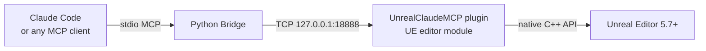

<div align="center">

# Unreal Claude MCP

**Drive Unreal Engine 5 from Claude Code over a local TCP socket.**

Nineteen editor-automation tools. Zero pixel-clicking. ~50ms round-trip.

[](https://github.com/NAJEMWEHBE/UnrealClaudeMCP/actions/workflows/tests.yml)
[](LICENSE)
[](https://www.unrealengine.com/)
[](https://www.python.org/)
[](https://modelcontextprotocol.io/)
[](#contributing)


</div>

---

## How it fits together



You ask Claude Code: *"Take a screenshot of my level and tell me what's there."* — Claude resolves the request to a tool call, the bridge forwards it as JSON-RPC to the running editor, the plugin captures the viewport, and Claude renders the image inline. Same flow works for spawning actors, inspecting Blueprints, mutating Widget Trees, executing arbitrary `unreal.*` Python, listing actors, focusing the viewport, loading levels, taking high-res screenshots.

The plugin binds to **`127.0.0.1` only** — your running editor is never reachable across the network.

---

## Why it exists

UE 5.7's Python reflection has known dead-ends. Most painfully: `EditorUtilityWidgetBlueprint.WidgetTree` is a `UPROPERTY()` without `EditAnywhere`, so neither `get_editor_property` nor direct attribute access can reach it. This blocks "let an LLM build me an editor utility panel" workflows entirely.

The plugin sidesteps these limits by calling UE's native C++ APIs directly inside the editor process. It's also dramatically faster than driving UE's GUI with screenshot pixel-clicks — **~50ms round-trip vs. minutes of GUI fiddling**.

---

## Tools

| Tool | Purpose |
|---|---|
| `execute_unreal_python` | Universal escape hatch — run arbitrary `unreal.*` Python in the editor's interpreter. Multi-line scripts work. |
| `get_project_summary` | Project name, engine version, enabled plugins, asset count. |
| `inspect_blueprint` | Variables, function/event graphs, parent class of any Blueprint asset. |
| `inspect_widget_tree` | Read the widget hierarchy of a `UWidgetBlueprint` or EUW (the thing UE Python can't do). |
| `edit_widget_tree` | Mutate the tree: `set_root` / `add_child` / `set_property`. Solves the EUW WidgetTree blocker. |
| `get_viewport_screenshot` | Active viewport as a base64 PNG, returned inline. |
| `take_high_res_screenshot` | Trigger UE's `HighResShot` console command. |
| `list_tools` | Names of every registered method (for autodiscovery). |
| `get_actors_in_level` | Name / class / transform of every actor; optional case-insensitive substring filter. |
| `focus_actor` | Select an actor by label and frame the viewport on it. |
| `load_level_by_path` | Open a level by package path. |
| `import_texture` | Bring an image file (PNG / JPG / EXR / TGA / BMP / HDR) from disk into the project as a `UTexture2D` asset via UE's canonical import path. |
| `configure_texture` | Adjust SRGB / compression / LOD group / filter on an existing texture asset. |
| `find_assets` | Query the asset registry by class + path + name. Returns matching assets so the LLM can discover what's available to spawn. |
| `spawn_actor` | Create an actor at a location with optional rotation, label, and initial properties. Class path supports built-ins and Blueprints. |
| `set_actor_transform` | Move / rotate / scale an existing actor by name. Absolute or relative mode. |
| `delete_actor` | Remove an actor by name. Force flag overrides children-attached safety check. |
| `set_actor_property` | Mutate any UPROPERTY on an actor. Supports primitives, FName/FText, vectors, rotators, colors, enums, and TSoftObjectPtr. |
| `add_component` | Attach a component (UActorComponent / USceneComponent subclass) to an existing actor at runtime, optionally socketed. |

Adding a 20th tool is one `.cpp` file plus one line of registration — see [`docs/ARCHITECTURE.md`](docs/ARCHITECTURE.md).

---

## Quick start

### Engineers (you already build UE projects from source)

1. **Drop the plugin in.** Copy `UnrealClaudeMCP/` into `<YourProject>/Plugins/`.
2. **Regenerate project files.** Right-click `<YourProject>.uproject` → *Generate Visual Studio project files*.
3. **Build the editor.** Open the .sln, build *Development Editor | Win64*. First build takes ~5–15 min.
4. **Launch.** Open the .uproject. The MCP server auto-starts on `127.0.0.1:18888`. Look for these lines in the Output Log:
   ```
   [LogUnrealClaudeMCP] Module started
   LogUCMCPHandler: Registered handler 'execute_unreal_python'
     ... (19 lines)
   [LogUCMCP] Listening on 127.0.0.1:18888
   ```
5. **Wire Claude Code.** Copy `examples/.mcp.json.example` to your project root as `.mcp.json`, edit the path to point at `bridge/unreal_claude_mcp_bridge.py`, restart Claude Code, and approve the new MCP server.

### Non-engineers / GUI-only users

See [`docs/INSTALLATION.md`](docs/INSTALLATION.md) — step-by-step, screenshot-first.

### Verify it works

The smoke test fires every default-on tool from a plain Python TCP client (not through Claude Code) — a fast way to confirm the plugin loaded and the server is alive:

```bash
python examples/smoke_test.py
```

You'll see nine sections of JSON output (the ninth is a build-a-level round-trip that spawns, transforms, mutates, and cleans up actors). Last line: *"Smoke test complete."*

---

## What's in the box

```
UnrealClaudeMCP/                The Unreal Engine plugin (drop into <Project>/Plugins/)
  Source/UnrealClaudeMCP/         C++ editor module
  Resources/                      MCP manifest JSON
  UnrealClaudeMCP.uplugin         Plugin manifest

bridge/
  unreal_claude_mcp_bridge.py     Python stdio ↔ TCP bridge for Claude Code MCP

examples/
  smoke_test.py                   Connects to the live server, fires the safe tools
  .mcp.json.example               Template Claude Code MCP config

docs/
  INSTALLATION.md                 Step-by-step install for a UE 5.7 project
  TOOLS.md                        What each tool does + JSON examples
  ARCHITECTURE.md                 How the pieces fit + UE 5.7 API gotchas

tests/                            Pytest suite for the bridge (no UE required)
.github/workflows/                CI runs the bridge tests on every push & PR
```

---

## Status

| | |
|---|---|
| **Latest release** | v0.3.0 — 2026-05-08 |
| **Tools** | 19 live, smoke-tested end-to-end |
| **Tested on** | UE 5.7.4 / Windows 11 / Visual Studio 2026 / MSVC 14.50 |
| **Bridge tests** | 71 pytest cases, ~99% coverage |
| **CI** | GitHub Actions on every push and PR |

---

## What this is NOT

- A general MCP server framework — this is bonded to UE's editor process.
- A live-broadcast tool — for that, look at vMix, OBS, NDI Studio Monitor.
- An Aximmetry / Pixotope / Disguise replacement — those have multi-engineer multi-year codebases.

---

## Contributing

Issues and PRs welcome. Two house rules:

1. **Verify UE API claims against UE 5.7 source.** Past reviewer subagents have made specific UE API claims that turned out wrong; ground-truth the engine source before committing.
2. **Each new MCP handler is one `Handler_*.cpp` file** in `Source/UnrealClaudeMCP/Private/MCP/Handlers/`, plus one `extern` declaration and one `Reg.Register(Make_Handler_*())` line in `UnrealClaudeMCPModule.cpp`. Don't grow the foundation — add handlers.

### Running tests

Bridge unit tests run without UE in under a second:

```bash
pip install pytest pytest-cov
pytest tests/
```

CI runs the same suite on every push and PR (see `.github/workflows/tests.yml`). The live integration smoke test in `examples/smoke_test.py` requires a running UE editor — see [`tests/README.md`](tests/README.md).

---

## License

MIT — see [`LICENSE`](LICENSE). © 2026 HD Media (Kuwait).
