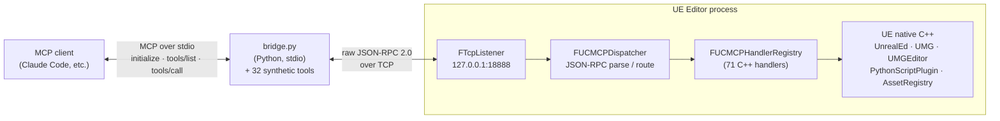
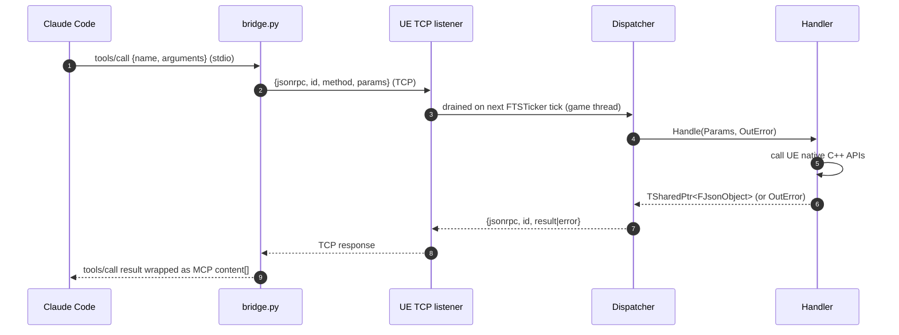

# Architecture

## The picture



Sequence of one `tools/call` round trip:



## The four C++ files that matter

```
Source/UnrealClaudeMCP/
  Public/MCP/
    MCPServer.h          (TCP listener interface)
    MCPDispatcher.h      (one static function: HandleMessage)
    MCPHandler.h         (handler interface + registry)
  Private/
    UnrealClaudeMCPModule.cpp   (registers all handlers + starts the server in StartupModule)
    MCP/
      MCPServer.cpp           (FTcpListener + per-tick recv/dispatch/send)
      MCPDispatcher.cpp       (parse JSON-RPC, look up handler, return JSON-RPC response)
      MCPHandler.cpp          (process-singleton FUCMCPHandlerRegistry)
      Handlers/
        Handler_*.cpp         (one per MCP method - pure leaves)
```

Each handler is a leaf with this shape:

```cpp
class FHandler_Foo : public IUCMCPHandler
{
public:
    virtual FString GetMethodName() const override { return TEXT("foo"); }

    virtual TSharedPtr<FJsonObject> Handle(const TSharedPtr<FJsonObject>& Params, FString& OutError) override
    {
        // 1. Parse params
        // 2. Call UE native C++ APIs
        // 3. Return TSharedPtr<FJsonObject> on success
        //    OR set OutError and return nullptr on failure
    }
};

TSharedRef<IUCMCPHandler> Make_Handler_Foo()
{
    return MakeShared<FHandler_Foo>();
}
```

Then in `UnrealClaudeMCPModule.cpp::StartupModule`:

```cpp
extern TSharedRef<IUCMCPHandler> Make_Handler_Foo();
// ...
FUCMCPHandlerRegistry::Get().Register(Make_Handler_Foo());
```

## Shared modules (v0.3.0+)

Three helpers extract cross-cutting concerns from multiple handlers. Each lives in `Source/UnrealClaudeMCP/Private/MCP/` (alongside `MCPServer.cpp` etc., not under `Handlers/`):

- **`ActorIdentity`** — hybrid label-or-FName actor lookup. Used by `set_actor_transform`, `delete_actor`, `set_actor_property`, `add_component`. Returns `EResolveResult::Ambiguous` with the candidate FNames listed when a label matches multiple actors, so handlers can produce actionable `ambiguous_actor` errors.
- **`PropertyCoercion`** — JSON ↔ FProperty value bridge. Supports the v0.3.0 type list (primitives, strings, FName/FText, FVector/FVector2D/FRotator/FLinearColor/FColor, enums, TSoftObjectPtr). Used by `spawn_actor.properties`, `set_actor_property`, and `add_component.relative_transform`. Returns `ECoerceResult::Unsupported` with the FProperty class name for types deferred to v0.4.0 (USTRUCT, TArray, TMap, FObjectProperty, FInstancedStruct).
- **`LogCapture`** (v0.6.0) — `FUCMCPLogCapture : public FOutputDevice`, a thread-safe ring buffer that captures the last 1000 UE Output Log entries. Registered globally via `GLog->AddOutputDevice` in `StartupModule` (before handler registration, so early log lines are captured) and deregistered in `ShutdownModule`. `get_log_lines` reads a snapshot from this buffer. **Thread safety:** `FOutputDeviceRedirector` calls registered output devices from any thread; `FUCMCPLogCapture::Serialize` takes a `FCriticalSection` lock for each write. `GetLines()` copies the ring under the same lock, then releases before filtering — the lock is never held while iterating.

Each handler stays a leaf — these modules just lift cross-cutting concerns to where they can be tested once. The "leaf with bounded responsibility" pattern still holds.

## Threading

`FTSTicker` callbacks run on the game thread. The TCP listener registers a per-tick callback that drains pending bytes, dispatches synchronously, and sends responses. Handlers therefore run on the game thread, where they can safely call any UE editor API.

Tradeoff: a slow handler will stall the editor's tick. This is acceptable for the current handler set — each call returns quickly. Genuinely long-running work (sleeps, multi-step pipelines) is handled by the task pattern (`start_sleep_task` / `poll_task` / `cancel_task` / `list_tasks`): the starter handler registers a task and returns immediately, and the work runs off the dispatch thread. Future handlers that block on disk I/O or the network should follow the same pattern instead of stalling the tick.

## JSON-RPC framing (v0.5.0+)

Every TCP message uses explicit length-prefixed framing. Each frame on the wire is:

```
+--------+--------+--------+--------+--------+--------+--------+--------+--------+--------+
|     8-byte big-endian uint64 body length     |       N bytes of UTF-8 JSON body         |
+--------+--------+--------+--------+--------+--------+--------+--------+--------+--------+
```

- The 8-byte prefix encodes the body byte count as an unsigned 64-bit integer in network (big-endian) byte order.
- The body is the raw UTF-8 JSON-RPC 2.0 object.
- Length of 0 is invalid. Length > 1 GB is invalid. Both are rejected with `framing_error`.

Both sides (`MCPServer.cpp` via `ReadFramedMessage` / `WriteFramedMessage`, and the bridge via `recv_framed` / `send_framed`) loop on `Recv` / `Send` until the exact byte count is transferred, eliminating the old "one `recv()` = one whole message" assumption.

**Stable error code: `framing_error`** — returned when the length prefix is unreadable, when the declared length exceeds the 1 GB cap, when the declared length is zero, or when body bytes stop arriving before the declared length is met (socket timeout or premature close).

Mixed-version connections (v0.4.0 bridge + v0.5.0 plugin, or vice versa) fail immediately with a framing error on the receiving side — loud, not silent. The bridge and plugin must be upgraded together.

## Why a Python bridge

Claude Code's MCP client speaks the **MCP protocol** (`initialize`, `tools/list`, `tools/call`) over stdio. The plugin's server speaks **raw JSON-RPC 2.0** over TCP, with custom method names like `execute_unreal_python`.

The bridge does two things:
1. Translates the MCP `initialize` / `tools/list` / `tools/call` envelope into raw method calls
2. Provides the static tool catalog with JSON Schema parameter descriptions (the catalog is duplicated from `Resources/mcp_manifest.json` because Claude Code expects it during `tools/list`)

If you don't use Claude Code, you don't need the bridge — connect to the TCP server directly.

## Build dependencies

`Source/UnrealClaudeMCP/UnrealClaudeMCP.Build.cs`:

```csharp
// PublicDependencyModuleNames
"Core",
"CoreUObject",
"Engine",
"UnrealEd",                       // UAssetImportTask, UTextureFactory, UFactory
"Slate",
"SlateCore",
"EditorScriptingUtilities",       // UEditorAssetLibrary in LoadLevel / SaveLoadedAsset / etc.
"EditorSubsystem",                // ULevelEditorSubsystem
"AssetRegistry",                  // GetProjectSummary asset count
"AssetTools",                     // IAssetTools::ImportAssetTasks
"Sockets", "Networking",          // TCP listener
"Json", "JsonUtilities",          // JSON-RPC framing
"PythonScriptPlugin",             // execute_unreal_python handler
"GraphEditor",                    // UEdGraph iteration in InspectBlueprint
"Kismet",                         // FBlueprintEditorUtils in EditWidgetTree
"EngineSettings",                 // UGeneralProjectSettings in GetProjectSummary
"UMG", "UMGEditor",               // widget classes + WidgetTree

// PrivateDependencyModuleNames
"InputCore",
"Projects",
"PropertyEditor",
"LevelEditor",
```

If a handler references a UE class whose owning module isn't in this list, the link step fails with `LNK2019: unresolved external symbol`. The fix is always to add the right module name. The UE source on disk is the ground truth — find the class declaration, look at the `_API` macro prefix, that names the module.

## Adding a new handler — full recipe

1. Decide the method name and the JSON shape of params + result.
2. Create `Source/UnrealClaudeMCP/Private/MCP/Handlers/Handler_NewThing.cpp`:
   ```cpp
   #include "MCP/MCPHandler.h"
   // ... include UE headers you need
   class FHandler_NewThing : public IUCMCPHandler { ... };
   TSharedRef<IUCMCPHandler> Make_Handler_NewThing() {
       return MakeShared<FHandler_NewThing>();
   }
   ```
3. In `UnrealClaudeMCPModule.cpp`, near the other `extern` declarations:
   ```cpp
   extern TSharedRef<IUCMCPHandler> Make_Handler_NewThing();
   ```
4. In `StartupModule`, near the other `Reg.Register` calls:
   ```cpp
   Reg.Register(Make_Handler_NewThing());
   ```
5. If the handler needs a new UE module, add it to `Build.cs`.
6. Update `Resources/mcp_manifest.json` with the new tool's schema.
7. If the bridge is used, add the same tool to the `TOOLS` list in `bridge/unreal_claude_mcp_bridge.py`.
8. Rebuild (`Build.bat UnrealEditor ...` or VS Build Solution).
9. Restart UE — the new tool registers automatically on module load.

## UE 5.7 API gotchas the original implementation hit (so you don't repeat them)

These are real bugs / surprises that cost hours to find. Documented here as a defensive scar collection:

- `FImageUtils::PNGCompressImageArray` takes `TArrayView64<const FColor>` source and `TArray64<uint8>` output. `CompressImageArray` is deprecated in 5.1 and writes a thumbnail-sized JPEG, not a PNG. (A reviewer subagent specifically told us the opposite — the source is the ground truth, not the model.)
- `EPythonCommandExecutionMode::ExecuteFile` accepts EITHER a file path OR literal source text — but its file-vs-source heuristic fails on multi-line scripts with comments. The handler always writes the source to a temp `.py` file under `Intermediate/UnrealClaudeMCPPython/` and passes the file path. Bulletproof.
- `FPluginDescriptor::EnabledByDefault` is `EPluginEnabledByDefault` (enum: `Unspecified` / `Enabled` / `Disabled`), NOT a bool. Cast to a string before serializing.
- `OnClicked.AddDynamic(this, &Class::Method)` is a preprocessor macro that captures the function name as a string at the call site. Wrapping it in a C++ template breaks the capture and crashes at runtime. Each binding is its own inline call.
- `BlueprintEditorLibrary.reparent_blueprint` crashes UE for `EditorUtilityWidgetBlueprint`. Workaround: delete the asset and recreate with `EditorUtilityWidgetBlueprintFactory.parent_class = <CustomClass>` from inception.
- `edit_widget_tree`-style mutations require `WT->Modify()` + `WT->MarkPackageDirty()` + `FBlueprintEditorUtils::MarkBlueprintAsStructurallyModified(WBP)` + `SaveLoadedAsset(WBP)` to persist. Compile is a separate concern; don't compile per-edit (it crashes when many edits arrive in quick succession). Compile once at the end of a batch via the explicit `compile: true` flag on the last call.
- `TUniquePtr<T>` defaulted destructors require the type to be complete. If you `=default` the destructor of a class that owns a `TUniquePtr<FTcpListener>` in its header, MSVC errors with "incomplete type". Move the destructor implementation to the `.cpp` so the include for the held type lives there.
- `UTexture` mutations require the full `PreEditChange(nullptr)` + `Modify()` + set property + `PostEditChangeProperty(emptyEvent)` + (optional `UpdateResource()` for GPU rebuild) + `UEditorAssetLibrary::SaveLoadedAsset(...)` dance. Skipping `UpdateResource()` lets the in-editor preview keep showing the **old** texture even after the new settings are saved to disk; reopening the asset doesn't refresh it because the cached resource is still the pre-edit one. Reference: `Engine/Source/Runtime/Engine/Classes/Engine/Texture.h:1883`.
- `TextureCompressionSettings` enum names drift across UE versions. UE 5.7 source at `Engine/Source/Runtime/Engine/Classes/Engine/TextureDefines.h` is the only authoritative list. The plan we shipped originally listed `TC_BC4`, `TC_BC5`, and `TEXTUREGROUP_Bake` as valid; none of those exist in UE 5.7. Always verify enum names against the version's source rather than copy-pasting from older docs.
- **UE 5.7 Python wrapper constructors do not always take args in property-name order.** Some take args in struct-memory order, which silently scrambles values if you assume the docstring property order matches positionally. Probed live on 2026-05-12 from the running editor:

  | Constructor | Positional order is... | Safe? |
  |---|---|---|
  | `unreal.Vector(1, 2, 3)` | `x=1, y=2, z=3` | ✓ matches property order |
  | `unreal.Vector2D(10, 20)` | `x=10, y=20` | ✓ matches property order |
  | `unreal.LinearColor(0.1, 0.2, 0.3, 0.4)` | `r=0.1, g=0.2, b=0.3, a=0.4` | ✓ matches property order |
  | `unreal.Quat(1, 2, 3, 4)` | `x=1, y=2, z=3, w=4` | ✓ matches property order |
  | `unreal.Rotator(1, 2, 3)` | **`roll=1, pitch=2, yaw=3`** | ✗ struct-memory order (Roll, Pitch, Yaw); fixed in PR #127 |
  | `unreal.Color(11, 22, 33, 44)` | **`b=11, g=22, r=33, a=44`** | ✗ BGRA struct-memory order (DirectX legacy); no current usage but the trap is real |

  **Rule:** for any `unreal.*` struct construction in bridge-emitted Python, use empty constructor + named property assignment instead of positional args:

  ```python
  _r = unreal.Rotator()
  _r.pitch = pitch_value
  _r.yaw = yaw_value
  _r.roll = roll_value
  ```

  Property assignment is invariant to UE's struct memory layout. Positional construction is fine only for `Vector`, `Vector2D`, `LinearColor`, `Quat` per the probe; treat any future struct as suspect until probed. A one-liner probe can validate any new struct in seconds:

  ```python
  s = unreal.SomeStruct(1, 2, 3)
  unreal.log(f"__PROBE__ unreal.SomeStruct(1,2,3) -> {s.field_a} {s.field_b} {s.field_c} __END__")
  ```

## License

MIT. © 2026 HD Media (Kuwait).
